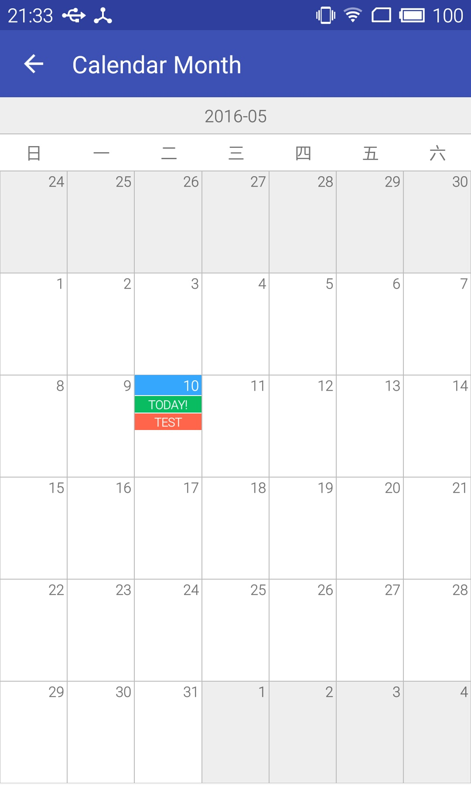

# AndroidDemo
Android Demo Android studio project. 
PS: Demo借鉴了很多好的开源项目,有的是copy了相关的源码,有的是直接添加了dependcies,仅供学习.

Contents
---
1. ListView and Adapter (包括可折叠式的ListView)
2. BottomTab (点击下方tab切换页面)
3. PinnedSectionList
4. Scrollview
5. StickyLayout
6. SwipeBack （滑动返回）
7. AppBar
8. ViewDrager （ViewDragerHelper实践）
9. Service and Broadcast
10. Notification and AsyncTask
11. Property animation (属性动画)
12. View touch 事件检测
13. AudioPlayerView (自定义的音频播放组件,利用自导MediaPlayer)
14. Sugar orm (简单使用)
15. Calendar Month(支持备忘的日历月视图)

